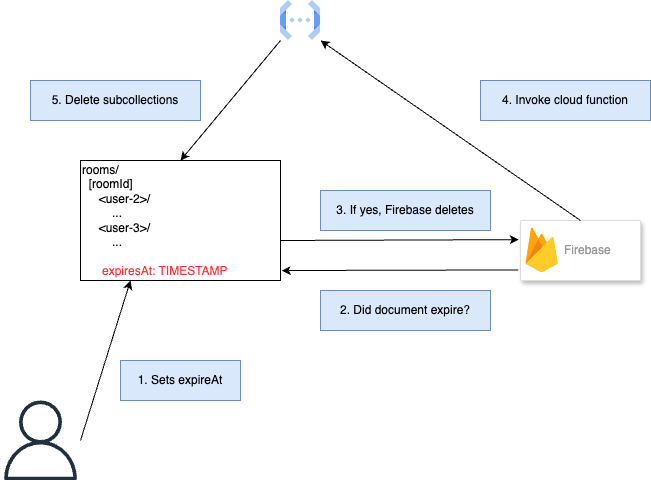

# Database Reclamation

30 Jan, 2025

Since Code Buddy is designed to be a serverless application, we don't have a central coordinator to manage rooms. Users
can independently create, join, and leave room. In the happy path, if users leave via our application UI, we can manage
database resources on their behalf. However, given the nature of browsers, we should expect that users can close their
browser, lose internet connection, etc., at any given moment. In this documentation, we outline the design decision to
reliably cleanup resources without any assumptions about the users.

## Data Retention Policy (TTL)

Firebase [TTL policies](https://firebase.google.com/docs/firestore/ttl) allows the database to delete "stale"
documentations. Thus, our primary challenge is to cleanup subcollections (see [Firestore data model](https://firebase.google.com/docs/firestore/data-model)).
To cleanup subcollections, we use a Firestore trigger to delete the subcollections when a room document is deleted.

The high level design is as follow:

1. On Google Cloud, we mark `expiresAt` as the TTL field, and set to `X` duration.
2. A server timestamp is set whenever the room document is modified.
3. When Firestore observer sees that a room "has expired", it will delete the document.
4. Such deletion will invoke the cloud function trigger, which recursively deletes all the subcollections.



> A server timestamp is set whenever the room document is modified.

Note that in practice, we can impose a different heuristics to set `expiresAt`, such as a periodic heartbeat from
users in the room.

## Alternatives Considered

### Crontask

A crontask checks and delete stale documents. This isn't ideal because we're effectively re-implementing (but worse) TTL
policies that Firestore offers.

### Only TTL

We don't need a cloud function if the subcollections can also be marked with TTL policy. However, TTL policy requires
a static collection naming, whereas our subcollection is dynamic, based on the username. To make this work, we
have 2 options:

1. Use a constant naming scheme for the subcollections.

   ```yaml
   rooms/
    [roomId]:
      user-2/
        user-1:
          expiresAt: TIMESTAMP
      user-3/
        user-1:
          expiresAt: TIMESTAMP
        user-2:
          expiresAt: TIMESTAMP

      expiresAt: TIMESTAMP
   ```

   This solution is subjective to race condition. For example, if `user-3` and `user-4` joins at the same time. `user-3`
   refreshes, rejoins the room, and effectively becomes `user-4`. However, the previous `user-4` has not finished
   establishing RTC connection.

2. Flatten the data model.

   ```yaml
   rooms/
    [roomId]:
      users: {
        <user-2>: {
          <user-1>: { ... }
        },

        <user-3>: {
          user-1: { ... }
          user-2: { ... }
        }
      }

      expiresAt: TIMESTAMP
   ```

   This approach requires a larger refactor to `RTCProvider` [at the time of writing](https://github.com/nickbar01234/codebuddy/blob/c522521fbcb536de81b2ed03ae95d7aeda32f1ff/extension/src/context/RTCProvider.tsx).
